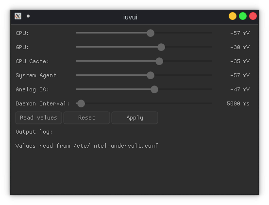

# iuvui - intel-undervolt user interface

GUI for [intel-undervolt](https://github.com/kitsunyan/intel-undervolt)

## Screenshot

## Dependencies & Requirements
- intel-undervolt
- root

## Thanks:
- [nuklear](https://github.com/vurtun/nuklear)

## Running:
- make & run as root
